<!--=======================================================================================================-->
<!--=                         Start of page content                                                       =-->
<!--=======================================================================================================-->
<head>
    <meta charset="UTF-8">
</head>

<h3 align="center"> <em> Manipulated photos detector using vanishing points (FakeVP) </em> </h3>

 Final project by 

 <b> Itay Katav, Jonathan Mey-Tal, Shahar Azoulai</b> 

    <a href="mailto:katavit@post.bgu.ac.il" class="course">katavit@post.bgu.ac.il</a> 
    <a href="mailto:Meyyon@post.bgu.ac.il" class="course">Meyyon@post.bgu.ac.il</a> 
    <a href="mailto:azoulais@post.bgu.ac.il" class="course">azoulais@post.bgu.ac.il</a>
  

  

<h3 align="left"> Introduction </h3>

Manipulations on photos is something that exists since the very beginning of photography. With the development of technology, both the methods for manipulation and the methods for detecting them photos have evolved a lot. Today, with the entrance of deep learning and generative models to our lives, the creation of fake photos have become much better and easier in a way that makes it hard to detect, especially in large scales. We chose to focus on a specific method that makes use of vanishing points for the detecting the principal point of the image which is unique.

What is vanishing and principal points?  If we are looking on two lines that are parallel in the real world, in the 2D image plane they will look like they are crossing a single point. A verry common example is railroad tracks as can be seen in the picture bellow.

Photo manipulation has been happening since the early days of photography. With technology advancements, both the manipulation techniques and methods to spot fake photos have evolved significantly. Nowadays, with deep learning and generative models becoming part of our lives, it's easier to manipulate photos but harder to detect these manipulations. In our project we are focusing our specific method to detect these manipulations that use vanishing points, exploiting the fact that there's only one principal point in a photo. But what are vanishing and principal points? Simply put, when you look at parallel lines in real life, they seem to meet at a single point in a 2D photo. A classic example is railroad tracks, as seen in the image below.

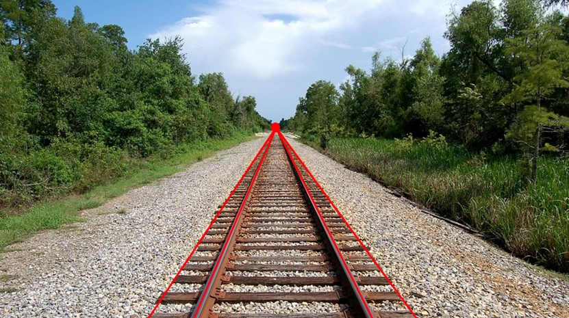

The reason why this phenomenon happens is because the perspective projection of straight lines in three-dimensional space (the real world) onto the two-dimensional image plane keeps the lines straight. In addition, more distant objects appear smaller, and the combination creates an effect of lines that get closer and closer towards the horizon.

This idea is known for very long time and is used for centuries by artists that wanted to create depth in their masterpieces. For example, in his famous painting  "The Last Supper", Leonardo da Vinci used this idea to create depth and to emphasize the presence of Jesus. 

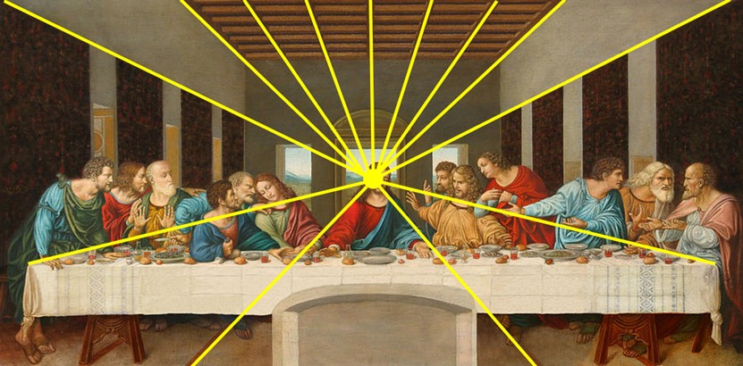

As mentioned, this phenomenon is a core in understanding the depth of a 2D image and it is widely used in fields where understanding the missing dimension is crucial such as 3D modelling, Virtual Reality, autonomous driving and more.

<h4>More than one vanishing point</h4>

It is possible to have multiple vanishing points in one image. The case that interests us is when it is possible to find three pairs of lines where each pair is parallel to each other and orthogonal to the 2 other pairs. Thus, we will have 3 vanishing points.

Connecting these 3 points will define a triangle which each of its sides is called a vanishing line. The orthocenter of this triangle is called the principal point of the image and it is unique to the specific image i.e.: as long as we choose the 3 pairs as described above we will get the same principal point.

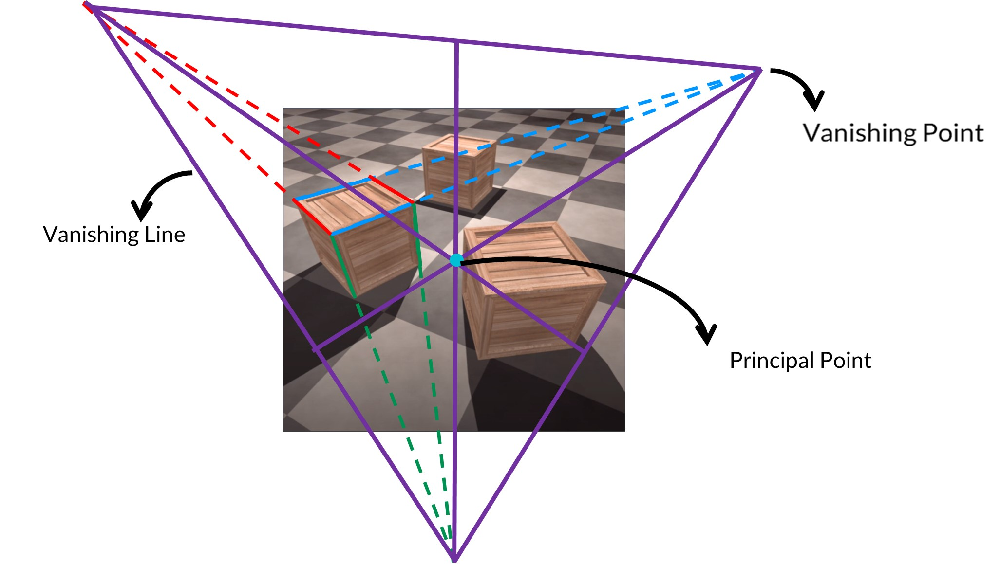

In the method we are implementing in this project we take advantage of the fact that a photo that has not been manipulated has only a single principal point. That means that if we choose different sets of lines from different object in the photo and we get two different principal points, then we can say that the photo has been manipulated.

<h3 align="left"> Approach and Method</h3>

Our plan was:

<ol>
  <li>Finding a principal point in photo. To be able to do it we need to:
    <ol type="a">
      <li>Find all the straight lines in the photo.</li>
      <li>Classify the lines to three class that each class contains set of parallel lines that orthogonal to all the lines in the other two class in the real world.</li>
      <li>Choosing a pair of lines from each class.</li>
      <li>Finding the vanishing point that corresponding to each class.</li>
      <li>Calculate the principal point according to the method we discuss above.</li>
    </ol>
  </li>
  <li>Doing the first step ones with the lines of a suspected object and ones with all the other lines in the photo.</li>
  <li>Compare the two principal points to decide whether the image has been manipulated.</li>
</ol>

<h3>First step: Finding the straight lines in the photo.</h3>

Given the image we want to extract the lines, to do it we tried two methods:

<ol>
  <li>
    <strong>First method: Gaussian smoothing + Canny edge detection + Hough transform</strong>
    
Gaussian Smoothing which performs a weighted average of surrounding pixels based on the Gaussian distribution, this method remove the noise in the image and will help Canny algorithm to perform better.

    
Canny edge detection to find the edges in the image which using them we can try to extract lines. Canny edge detection output:

    

    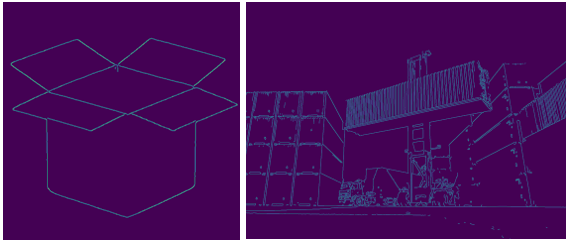
    
    
We can see that Canny output is quite good and can be helpful for our purpose.

    
We used Hough Transform algorithm to detect the lines, we can see the Hough transform algorithm on the box:

    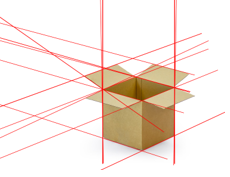
    
the output is good we just need to do some post proccessing to remove the lines that are not on the edges, so if the hough transform line is not on the canny edge we removed it and got as output:

    
    
The problem with Hough transform is when we want to use it on different images we need to adjust the hyperparameters, if we use the same hyperparameters for different images we might get useless results.

    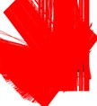
</li>
<li>
    <strong>Second method: Line Segment Detection (LSD)</strong>
    
Using the LSD we don’t need to adjust the hyperparamters for different imges, the output for the LSD algorithm with the same hyperparamters:

    
    
which is the expected output.

</li>
</ol>

<h3>Second step: Classify the lines.</h3>

Given all the lines from the LSD algorithm, we need to classify them into 4 classes.
  3 classes which each line in these classes is parallel to all the other lines in its class and orthogonal to all the other 2 classes' lines, the last class is the outliers which we cannot give a good prediction for. Just when we start to think about this problem, we realized that this is a hard task. When examining pairs of lines in the 2D image space without a semantic context, it is very difficult to decide what was the relationship between them (parallel or orthogonal or neither) in the 3D world.
  .

Therefore, we accessed the internet and the academic literature to check and understand how the problem is dealt with and which existing works are already successful in this task. We were surprised to discover the amount of research, and the wide use in a variety of fields that try to solve the problem (finding vanishing points). Such fields include virtual reality, autonomous driving, 3D reconstruction, and for our case, fake photos detection. After thorough research we decided to dive into a specific article that seemed to solve the problem well given the information we have, the article is called: " 2-Line Exhaustive Searching for Real-Time Vanishing Point Estimation in Manhattan World " by Xiaohu Lu, Jian Yao†, Haoang Li, Yahui Liu School of Remote Sensing and Information Engineering, Wuhan University, Wuhan, Hubei, China. So indeed, in this paper they try to classify the straight lines in the picture in the same way we detailed above. The way they do it is as following:

First, they build a polar grid by extending the unit vectors on the equivalent sphere to intersect with the image plane. The equivalent sphere is a unit sphere which centers in the focal point of the camera (in practice we don’t know yet the focal point, so we used the center of the image) the distance of the sphere from the image plane is the focal length of the camera (also this value we didn’t always had) as the following figure is shown.

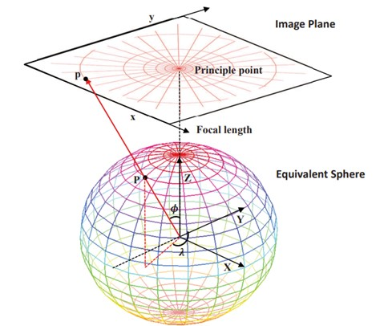

They showed how they find points and straight lines on the polar grid that correspond to points and lines from the image plane and vice versa. After they looked for potential set of three vanishing points on the polar grid.

To find the first point, they calculated the probability that given a random selection of two lines from the set of lines (by making assumptions regarding the distribution of the lines between the different classes) how many guesses are needed for at least one of the pairs to intersect at the vanishing point, over all 105 hypotheses of v1.

For the second vanishing point considering the orthogonal constraint of the three points, given the first vanishing point v1 = (X1, Y1, Z1), the second vanishing point must lie on the great circle of v1 in the equivalent sphere as shown in the figure. So, they split the circle into 360 points (accuracy of 1 degree). Finally, with both the hypothesis for V1 and V2 the third vanishing point can be obtained as v3 = v1 × v2. there will be totally 105 × 360 = 37800 hypotheses for three orthogonal vanishing points, which will then be validated to choose the best ones.

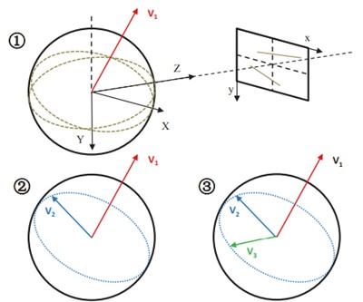

The final step of the method is to choose the best hypothesis. The choosing of the best hypothesis preforming via "vote" mechanism which each line is "voting" for a vanishing point if cross it. The hypothesis of the set of the three points that gets the most votes is the one that chooses, and the classification of the lines are according to these points.

In our case we only used the classification that the algorithm performs and calculated the vanishing points in a different way that resulted in better results for our case.

<h3>Third step: Choosing a pair of lines from each class.</h3>

Though the classification algorithm performs pretty well, there are still some failures that in our case may cause a high rate of false-positives (stating that the image has been manipulated when it wasn’t). Below we can see lines detected by the LSD algorithm for an image of a kitchen. Without the context (left image), it might be hard to conclude which lines are parallel. For example, the 2 lines highlighted in blue may seem parallel without the background of the input image.

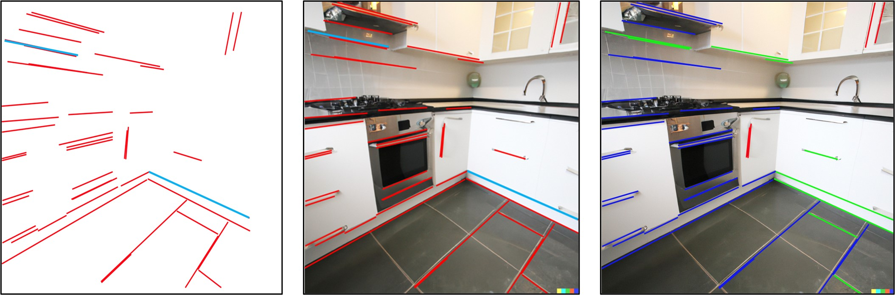

The classification algorithm falls short and indeed classifies these pair of lines as parallel even though they belong to different perpendicular planes.

To overcome this problem we added two steps, filtering and choosing:

<ul>
    <li><strong>Filtering:</strong>
        
Parallel lines in the 3D scene shouldn't be parallel in the image plane (they can be but in our case, we don't want such cases). However, in most cases we would expect parallel lines in the 3D world to have a relatively close orientation in the 2D image plane. Thus, we have taken each cluster of lines and calculated the mean and the standard-deviation of the slope values of the lines assembling it. Then, we removed lines that have a slope that is far from their cluster's mean (>2*std) and close to some other cluster's mean (smaller then 1*std). In other words, if a line is an outlier in its associated cluster and is an inlier in another, we say that we have a low confidence about it and we don't want to use it at all.

        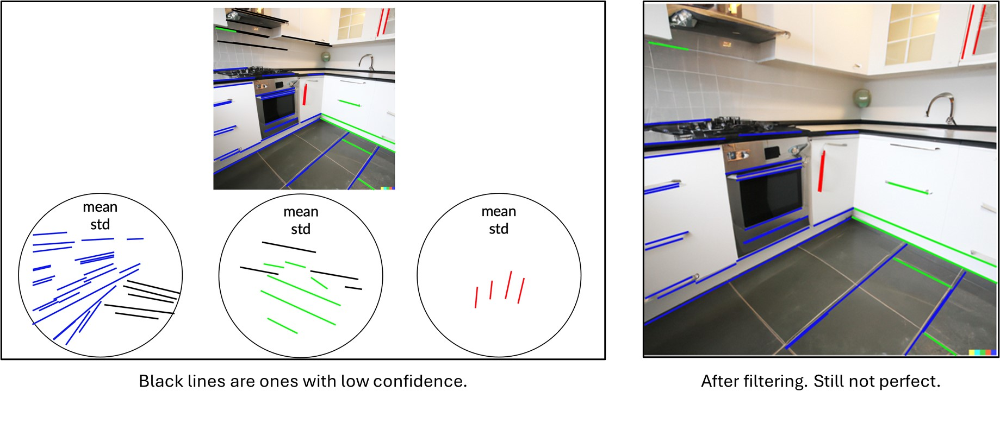
    </li>
    <li><strong>Choosing:</strong>
        
Filtering is doing pretty well as we can see in the given image, but it is still not perfect (marked in red circle). Fortunately, to find the principal point of an image we only need a pair of lines from each cluster so choosing wisely should overcome inaccuracies in the classification to this point.

        
Under the assumption that in each cluster the majority of lines are indeed parallel to each other we do the following steps:

        <ol>
            <li>Foreach possible pair ((n choose 2) pairs overall) we calculate the intersection of the two. If the lines are parallel in the 3D world, then this point is a vanishing point.</li>
            <li>Given all possible intersection points (a total of (n choose 2)), the median in all x coordinates and the median in all y coordinates are calculated. Let’s notate the medians by med_x,med_y respectively.</li>
            <li>We define a new point p̃=(med_x,med_y).</li>
            <li>Then we look for the intersection point which has the minimal Euclidean distance to p̃. The pair which is associated with that intersection point is chosen.</li>
            <li>We perform the same scheme for every cluster.</li>
        </ol>
    </li>
</ul>

<strong>Comment:</strong> At first we did the same process using the average point instead of the median. However, in many cases there are outliers and in some cases, they can approach infinity (when a pair of lines is parallel). Such cases affected the average point heavily and therefore we used the median instead, which performed much better.

<h3>Last step: Finding the vanishing points and principle point</h3>

After we integrated all the parts together, we saw that the classification algorithm from the paper doesn’t perform well on pictures with few or only one object.  The paper aims to work on images called "Manhattan" images, meaning images of an urban environment, and our problem happened because of the way the algorithm works, it needs a lot of lines from each orthogonal space to choose the right classification. In our case when we need to determine the principal point according to the lines of only the selected object, we couldn't make it work properly so eventually we decided that for this project the lines of the selected object will be chosen manually.

To find the vanishing point we choose the intersection point of each two lines, now we have three intersection points to find the principle point of them we need to take the center of the triangle that they create, and this is the principal point.

<h3 align="left"> Results</h3>

When we run the exec or the code we will be asked to upload image:

Then we will see this window:

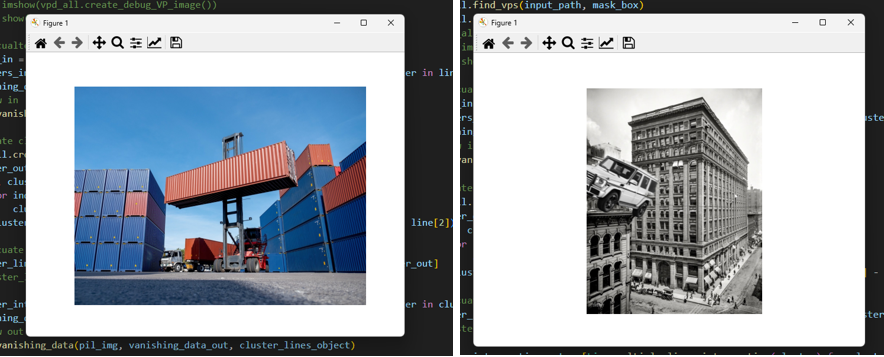

To select the object that we want to check his principle point against the background (all the not selected area) and select three sets of two lines which the two lines are parallel to each other and the sets are orthogonal to each other:

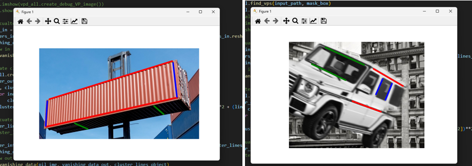

The algorithm will return the principle points of the image and the object and will classify if the object is fake or we can't decide if it is fake.

For the container example, we got that we can't decide if the container does not belong to the image:

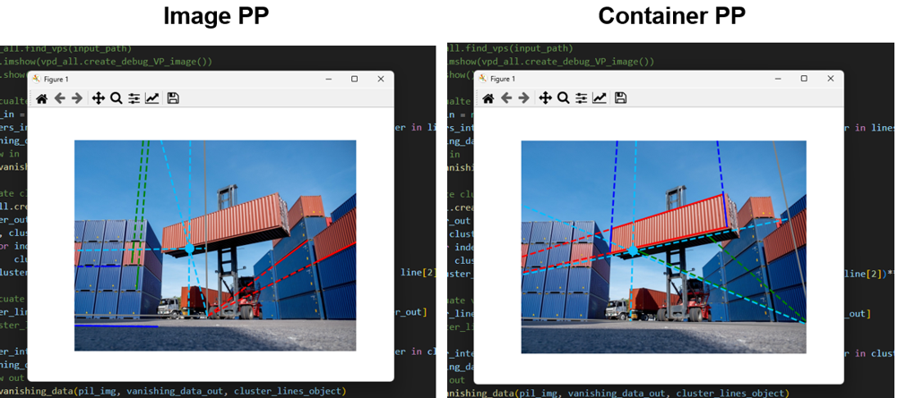

And for the “flying jeep” we classified it as FAKE! Because the principle points are far away from each other.

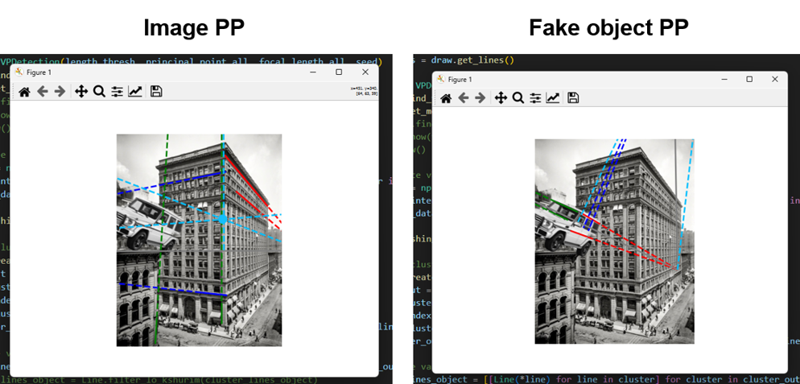

Note that to classify if the object is fake or not we used a threshold of the distance between the two principle points. The threshold is defined as a proportion of the image width and length combination, so in that way the algorithm is defined for each image size.

<h3 align="left"> Project's Video</h3>
<i>Do not touch. Here your project's video clip will be embedded by us...</i>

    <iframe width="560" height="315" src="https://www.youtube.com/embed/LYcXAEZfQFY" frameborder="0" allow="accelerometer; autoplay; clipboard-write; encrypted-media; gyroscope; picture-in-picture" allowfullscreen=""></iframe>

<h3 align="left"> Conclusions</h3>

There are tasks that for humans can be very simple but for a machine very, very difficult. In our case it is very easy for humans to understand from an image which lines were probably parallel in the world and which were not, but for the computer lacking semantic understanding this is a difficult task.

Future improvements: more convenient user interface, single object line selection automatically, improved performance for a larger variety of image types

<h3 align="left"> Additional Information</h3>

<ul>
    <li> Full project report (<a href="ICBV241-2-pdf.pdf" class="course">PDF</a>).
    </li>
    <li> Oral presentation slides (<a href="ICBV241-2-Presentation.pptx" class="course">ppt</a> , <a href="ICBV241-2-Presentation_pdf.pdf" class="course">PDF</a>).
    </li>
    <li> Project's video file (<a href="ICBV241-2-video.mp4" class="course">video_file</a>).
    </li>
    <li> <a href="ICBV241-2-exec.zip" class="course">Downloadable executable</a>
    </li>
    <li> <a href="ICBV241-2-run_example.pdf" class="course">How To Run Example</a>
    </li>
    <li> <a href="ICBV241-2-code.zip" class="course">Downloadable source code</a>.
    </li>
</ul>

<h3 align="left"> References </h3>
<ul align="justify">
    <li><a href="http://xiaohulugo.github.io/papers/Vanishing_Point_Detection_WACV2017.pdf" target="_blank">Vanishing Point Detection - WACV 2017</a></li>
    <li><a href="https://mitpress.mit.edu/9780262537490/fake-photos/" target="_blank">Fake Photos and the Engineering of Reality</a></li>
    <li><a href="https://www.youtube.com/watch?v=7cOx8XU3NS4" target="_blank">Vanishing Points and Lines - YouTube</a></li>
    <li><a href="https://docs.opencv.org/3.4/db/d73/classcv_1_1LineSegmentDetector.html" target="_blank">OpenCV - LineSegmentDetector</a></li>
    <li><a href="https://en.wikipedia.org/wiki/Canny_edge_detector" target="_blank">Canny Edge Detector - Wikipedia</a></li>
    <li><a href="https://en.wikipedia.org/wiki/Gaussian_blur" target="_blank">Gaussian Blur - Wikipedia</a></li>
  </ul><!--=======================================================================================================-->
<!--=                         End of page content                                                       =-->
<!--=======================================================================================================-->
<notoc></notoc>
